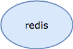
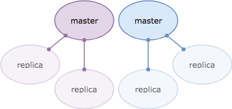

# Blacksmith Redis Forge

This Blacksmith Forge teaches a [Blacksmith Broker][broker] how to
deploy standalone and clustered [Redis][redis] service
deployments, which are useful for caching, persistent key-value
store, and distributed lock management.

## Deploying

To deploy this forge, you will need to add it to your existing
Blacksmith Broker manifest deployment, co-locating the
`redis-blacksmith-plans` job on the Blacksmith instance group.

Here's an example to get you started (clipped for brevity):

```yaml
releases:
  - name:    redis-forge
    version: latest

instance_groups:
  - name: blacksmith
    jobs:
      - name:    redis-blacksmith-plans
        release: redis-forge
        properties:
          plans:
            # your plans here
            # (see below)
```

The Redis Forge deploys redis by using jobs that are found
_inside_ the `redis-forge` BOSH release, which means that your
Blacksmith BOSH director also needs that release.  Blacksmith is
able to upload that release for you, if you want.

For the Spruce users out there:

```
---
instance_groups:
  - name: blacksmith
    jobs:
      - name: blacksmith
        properties:
          releases:
            - (( append ))
            - (( grab releases.redis-forge ))
```

Finally, you'll need to define plans for Blacksmith to deploy.
The following sections discuss those ad nauseum.

## Standalone Topology

The `standalone` topology is as straightforward as they come: a
singe dedicated VM that runs redis bound on all interfaces, to
port 6379.

Here's a diagram to clear things up:



### Configuration Options

- *vm_type* - The name of a BOSH `vm_type` from your cloud-config.
  You can use this to size your Redis appropriate to your workload
  requirements, in terms of RAM and CPU.  Increasing the disk size
  via the VM type is not going to net you much of a gain (see
  the `disk_size` and `persist` options instead.

- *az* - A single BOSH availability zone name (per cloud-config),
  for your standalone node placement.  By default, the node will be
  put in `z1`.

- *network* - The name of the network to deply these instances to.
  This network should be defined in your cloud-config, and should
  be large enough to handle your anticipated service footprint.
  It does not need any static IP addresses.

  By default, VMs will be deployed into a network named
  `redis-service`.

- *persist* - Whether or not the data stored in this Redis
  instance should be written to disk or not.  If you are just
  implementing a cache service using Redis, you don't need to
  specify this (or `disk`) -- by default this topology is
  diskless.

  Persistent Redis instances use the append-only format (AOF),
  storing the file in `/var/vcap/store/standalone/redis.aof`.  The
  AOF file is fsync'd once every second to balance safety with
  performance.

- *disk* - If you specify `persist` to get a durable key-value
  store, you can also specify this configuration value to change
  the size of the persistent disk.  By default, you get a 1G disk.

### Example Configuration

A single standalone plan, persistent, with 4G of disk:

```
instance_groups:
  - name: blacksmith
    jobs:
      - name:    redis-blacksmith-plans
        release: redis-forge
        properties:
          plans:
            single-4g:
              type:    standalone
              persist: true
              disk:    4_096
```

Here's a configuration that provides two different sizes of
persistent standalone, as well as a large (per cloud-config)
non-persistent cache service:

```
instance_groups:
  - name: blacksmith
    jobs:
      - name:    redis-blacksmith-plans
        release: redis-forge
        properties:
          plans:
            small:
              type:    standalone
              persist: true
              disk:    4_096

            large:
              type:    standalone
              persist: true
              disk:    16_384

            cache:
              type:    standalone
```

## Clustered Topology

The `cluster` topology shards the Redis key hash space across _M_
masters, each with _R_ replicas.  It provides fault tolerance,
with optional (but highly encouraged) striping across BOSH
availability zones.

Here's a diagram, showing a _M=2, R=2_ configuration:



We can refer to this as a _2x2_ setup, 2 masters, with 2 replicas
each, for a total of 6 VMs.  The first master (in purple) will
handle hash slots 0-8191, and the second master (in blue) takes
slots 8192-16382.  Each pair of replicas contain a complete copy
of the hash slots its master is responsible for.

In the event of failure of a master, one of its replicas will
promote to a master, ensuring consistent cluster operations.

Clustered nodes do not persist their data to disk; instead they
rely on replication to ensure durability of the data.

### Configuration Options

- *vm_type* - The name of a BOSH `vm_type` from your cloud-config.
  You can use this to size your Redis appropriate to your workload
  requirements, in terms of RAM and CPU.

- *azs* - A list of BOSH availability zone names (per
  cloud-config), across which to stripe the nodes.  By default,
  nodes will be put in `z1` and `z2`.

- *network* - The name of the network to deply these instances to.
  This network should be defined in your cloud-config, and should
  be large enough to handle your anticipated service footprint.
  It does not need any static IP addresses.

  By default, VMs will be deployed into a network named
  `redis-service`.

- *masters* - How many Redis Master instances to spin.  Must be at
  least 1.  There is no default.

- *replicas* - How many Redis Replica instances to provision for
  each Redis Master.  Must be at least 1, which is the default.
  Normally, you only need 1-3 replicas, depending on your
  tolerance for data loss.

## Example Configuration

Here's the configuration for the 6-VM 2x2 cluster pictured in the
topology digram above:

```
instance_groups:
  - name: blacksmith
    jobs:
      - name:    redis-blacksmith-plans
        release: redis-forge
        properties:
          plans:
            clustered:
              type:     cluster
              masters:  2
              replicas: 2
```

Here, we provide two different clustered configurations, one with
wide sharding but shallow replication (4x1), and another 3-node
minimal cluster on very large (per cloud-config) VMs.

```
instance_groups:
  - name: blacksmith
    jobs:
      - name:    redis-blacksmith-plans
        release: redis-forge
        properties:
          plans:
            clustered-4x1:
              type:     cluster
              masters:  4
              replicas: 1

            minimal:
              type:     cluster
              vm_type:  very-large
              masters:  1
              replicas: 2
```

## CF create-service configuration parameters
App developers can customize the following parameters. See the [Redis documentation](https://redis.io/topics/config) for more detail. In particular, look at the self documented redis.conf file for your deployed Redis version.

|                Property                 | Default | Options | Description |
|-----------------------------|---------|---------| ----------- |
| **maxmemory-policy** | *allkeys-lru*	| allkeys-lru, noeviction,<br/> volatile-lru,<br/> allkeys-random,<br/> volatile-ttl,<br/> volatile-lfu,<br/> allkeys-lfu | Sets the behavior Redis follows when *maxmemory* is reached |
| **notify-keyspace-events** | “” | Set a combination of the following characters<br/> (e.g., *“Elg”*):<br/> K, E, g, $, l, s, h, z, x, e, A | Sets the keyspace notifications for events that affect the Redis data set |
| **slowlog-log-slower-than** | 10000 | 0-20000 | Sets the threshhold execution time (seconds). Commands that exceed this execution time are added to the slowlog. |
| **slowlog-max-len** | 128 | 1-2024 | Sets the length (count) of the slowlog queue.|

## Contributing

If you find a bug, please raise a [Github Issue][1] first,
before submitting a PR.


[1]: https://github.com/blacksmith-community/redis-forge-boshrelease/issues
[broker]: https://github.com/cloudfoundry-community/blacksmith
[redis]:  https://redis.io
